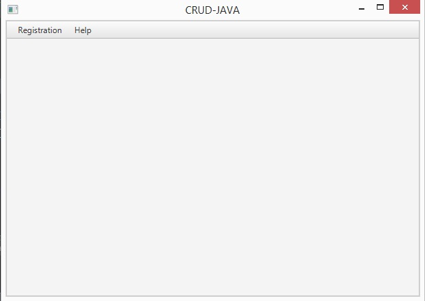
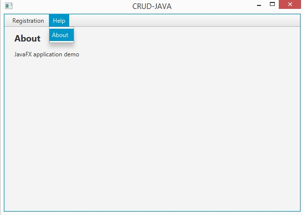
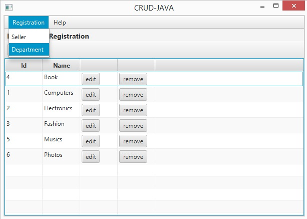
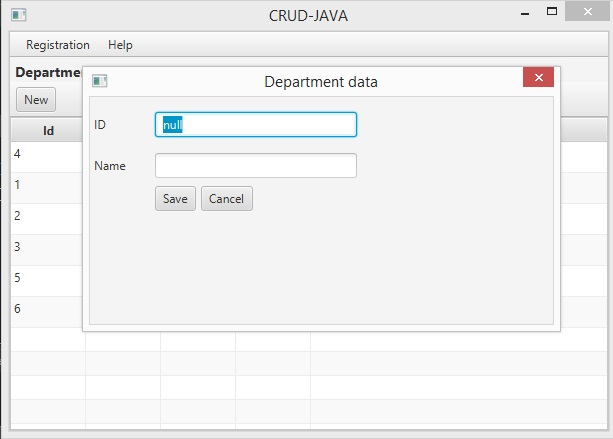
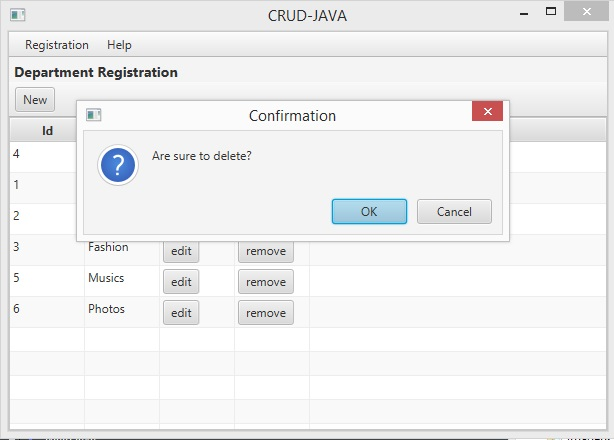
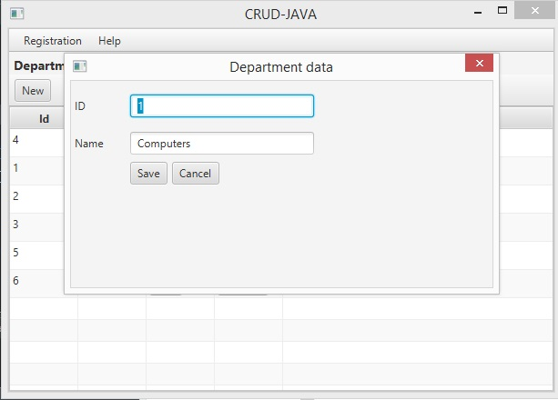
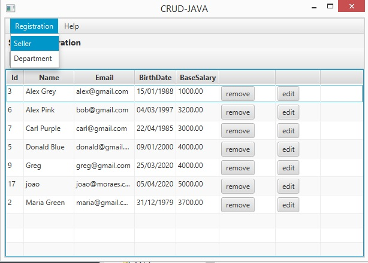
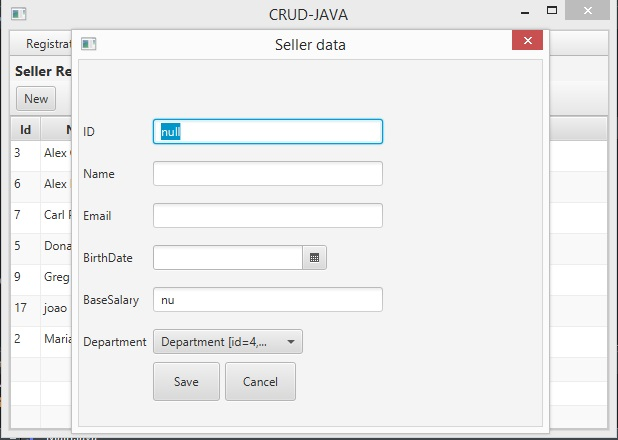
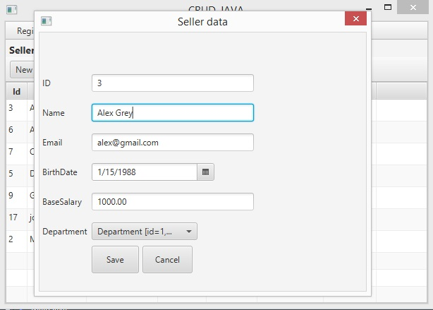
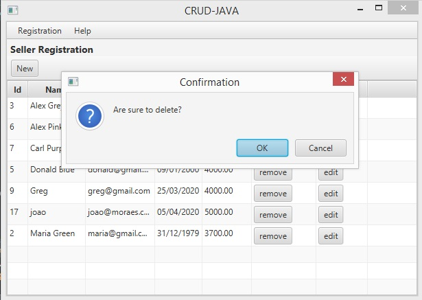

# CRUD JAVA

## Desenvolvimento do CRUD básico com API'S EM java e suas bibliotecas.
 

     

### Telas Desenvolvidas com [SceneBuilder](https://gluonhq.com/products/scene-builder/) ℹ

##### Tela Principal

> Main View

##### Tela Sobre

> About View

##### Tela Department

> Department List

##### Tela Department > Form 

> Department Form

##### Tela Department > Delete

> Department Delete

##### Tela Department > Edit

> Department Edit

##### Tela Seller 

> Seller List

##### Tela Seller > Form

> Seller Form

##### Tela Seller > Edit

> Seller Edit

##### Tela Seller > Remove

> Seller Remove

